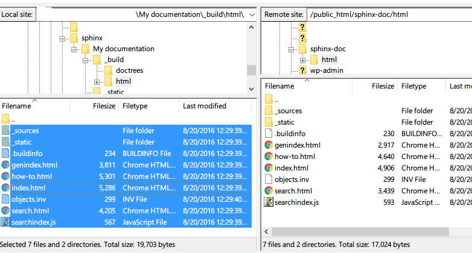

How to Synchronize Server folder with the local folder
======================================================

Here is the example to synchronize server folder with local folder. 

This `Tutorial <http://smallbusiness.chron.com/synchronize-filezilla-47982.html>`_
shows you how to create synchronized folder using filezilla. 

- I have used ``/public_html/sphinx-doc/html`` folder on g-------n.org, to 
  sync with ``c:\users\sphinx\my documentation\_build\html``.
- Filezilla may not prompt to sync, in that case select all files and click
  upload.

